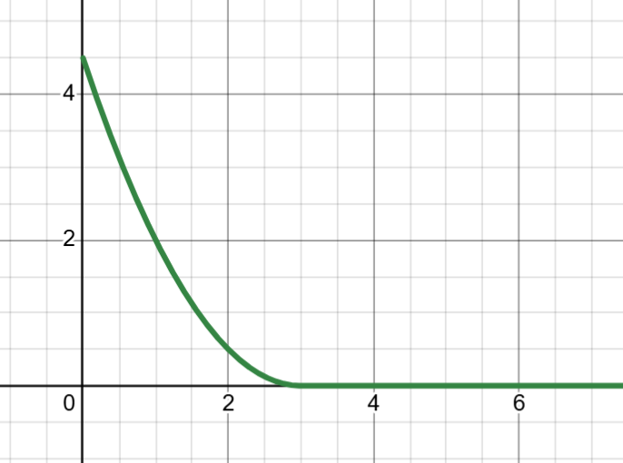
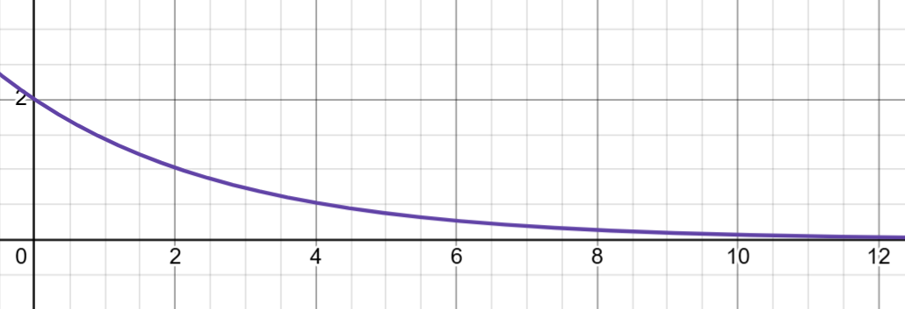
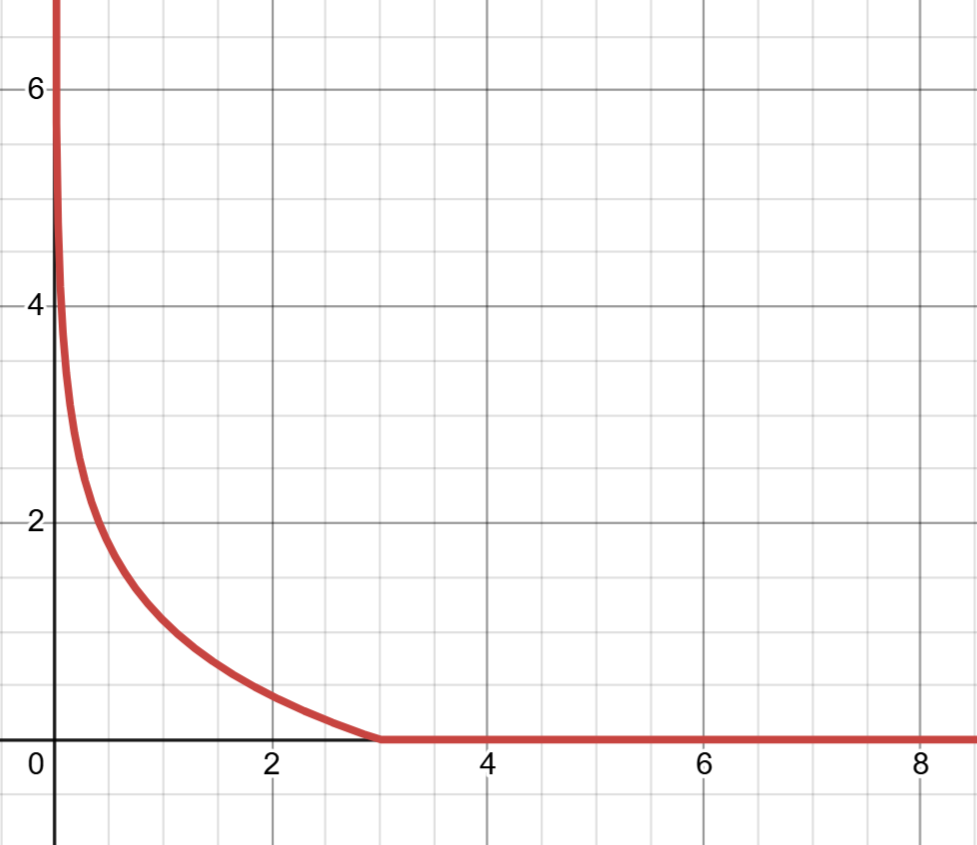

# Multi-Particle Animation with Social Forces
## Overview
This document will provide an analysis of simulating multi-particle systems using social force models within a gradient descent optimization framework. This simulation builds upon the basic principle of singular particle motion following a downward gradient towards a goal, but includes "social" forces between the particles adding another level of complexity.

The Simulation will run on a 2x2 grid. The grid will consist of multiple walls and particles (dots on the simulation). the larger stationary dots will be the goals that the particle will tend to move towards. If there are multiple goals, each particle will have s designated goal they will want to reach. The Idea is to run multiple simulations of positions and wall positions to observe the behavior of the particles.

This simulation will tackle two main types of social forces: Isotropic and Anisotropic. **Isotropic** models, which rely purely on Euclidean distance, and **Anisotropic** models, which incorporate velocity-dependent directional bias. we will compare the results and actions and note any patterns associated with one or the other types of forces

[]

## Cost Function Formulation
The the particle animation are using the standard gradient-descent algorithm to reach their goal:
$$
\begin{align}
\hat{\bf  \Phi} = \arg_{{{\bf  \Phi}}}\min C\left({\bf  \Phi}\right),
%\label{simple_motion_min}
\end{align}
$$

For a system of N particles with random positions
$$
\begin{align}
C_i (x_i)=C_{goal}(x_i) +C_{walls}(x_i)+\sum_{i\neq j}C_{social}(x_i,x_j)
%\label{cost_function}
\end{align}
$$
where:
- $C_{goal}$: Attracts the particle to its target destination.
- $C_{walls}$: Repels the particle from static environment boundaries.
- $C_{social}$: Repels the particle from other dynamic agents $j$.

## Gradient Descent Motion
This simulation uses a more fluid approach where velocity is directly proportional to the negative gradient of the cost function (a.k.a moving downward). 
The equation bellow is the general gradient decent algorithms with time step $k$ is:
$$
x_{i, (k+1)}  =  x_{i,k}  - α ∇x_iC_i
$$
Here, $\alpha$ is the step size (learning rate).

### Calculating the Derivative
For this simulation, we primarily use a modified version than the base definition to calculate the derivative.
From the definition derivative:
$$
\frac{df}{dx} = \lim_{ \Delta x \to 0 } \frac{ f(x + \Delta x) - f(x)}{\Delta x}
$$
We can modify the definition include the negative variation resulting in:
 $$
\frac{df}{dx} = \lim_{ \Delta x \to 0 } \frac{ f(x + \Delta x) - f(x - \Delta x)}{2\Delta x}
$$
Which we can use the central approximation of the derivative to get the final equation:
 $$
\frac{df}{dx} \approx \frac{ f(x + \Delta x) - f(x - \Delta x)}{2\Delta x}
$$
This equation shows more stability with the particles since it also includes derivatives of both directions instead of one.
*Note: This option can be changed in the program but for the purpose of this document we will only be using this equation*

## Social Force Models

### Isotropic Models
Isotropic forces assume that the repulsion between two particles depends **only** on the Euclidean distance $d_{ij} = ||\mathbf{x}_i - \mathbf{x}_j||$. The interaction is symmetric regardless of the particles' relative velocities.

#### Quadratic Repulsion (Soft Personal Space)
Defines a specific radius $R$ of personal space. No force is exerted beyond this radius.
$$
C_{social}(i, j)  = \begin{cases}
    0.5(R-d_{i,j})^2, & \text{if } d_{i,j} < R \\
    0, & \text{else }
\end{cases}
$$

**Figure 1: shows the Quadratic Repulsion function**

#### Exponential Social Force
Inspired by Helbing & Molnár, this models psychological repulsion that exists even at moderate distances.
$$
C_{social}(i, j) = A  e^{ -\frac {dij}{B} }
$$
Where A and B are arbitrarily set values greater than 0. A controlling the cost when getting too close and B controls cost in longer ranges.

**Figure 2: shows the Exponential Social Force function with A =2 and B =3**

## Anisotropic Models (Velocity-Dependent)
These particles act strongly when moving towards other particles. They act more in advance based on what direction they are currently moving towards. Here, the dot product between the direction and the direction of the particle is best used to maximize the social penalty. It will act as a predictor, if the particle is on path to another, the function returns a stronger cost function, in which the particle will slow down sooner than just running the isotropic function. (*Note: since this equation is based on direction, when calculating the gradient, the partial derivatives will also need to consider their vector directions*)
$$
C_{anisocial}(i,j) = (1+\beta \max( 0, \hat v_i  \cdot \frac {x_j -x_i}{||x_j -x_i||})) \phi (|| x_i -x_j||)
$$
Where:
- $\phi$ - Is the isotropic function (distance-based) 
- $\hat v$ - is the unit vector direction of the particle's velocity
- $\beta$ - is an arbitrary number >= 0 which controls the directional bias.

## Wall Forces
In the previous model, we covered multiple different wall penalty costs. For this simulation, we will only use one function. We define the general equation as
$$
C_{walls}(x_i) = \sum_i C_{wall_i}(x_i)
$$

For this simulation, we will use the natural log function as the cost function for getting too close to the wall. The natural log function has a very weak cost penalty starting out, but ramps up quickly. This can help prevent particles from grouping and pushing too hard on the boundaries of the wall and slipping through
$$
C_{wall_i}(x_i) = \begin{cases}
ln(R/d), & 0<d\leq R \\
0, & d>R
\end{cases}
$$

**Figure 3: shows the Natural Log function used for wall costs**
## Implementation
the code and variables used are found in **multiple_particles.ipynb**. Videos will be used based on parameter changes set in the file

## Simulations
#### Isotropic

Video1: simulation of the Baseline map with isotropic particles

Video2: simulation of the Zigzag map with isotropic particles

Video3: simulation of the Dead-ended map with isotropic particles

Video4: simulation of the Symmetric map with isotropic particles

#### Anisotropic

Video5: simulation of the Baseline map with anisotropic particles

Video6: simulation of the Zigzag  map with anisotropic particles

Video7: simulation of the Dead-ended map with anisotropic particles

Video8: simulation of the Symmetric map with anisotropic particles

## Analysis
Particles tend to overall stay further away from each other than the isotropic. which requires a range adjustment to fairly compare the social functions.

Overall the particles interactions behave more greedily in the isotropic method than the anisotropic. In cases where two or more particles meet at the same goal (assuming the particles have the same goal), one particle will overtake the other and take the goal. Anisotropic will spread out evenly as there is no way to reach the goal or the cost will spike due to running into the other particle.

Particles on head on collision tend to find a way to pass each other but the anisotropic particles stop way earlier and their speeds tend to be overall consistent as a result. the isotropic particles run as close as they can before stopping and veering around each other.

## Conclusion
isotropic particles tend to take the greediest path and will have to turn when necessary. While the anisotropic have to turn earlier and find more open space to maneuver around other particles. Overall, both particles act similar on many different aspects, but when there are a lot of collisions, the anisotropic particles tend to move more smoothly (more consistent speed) around.